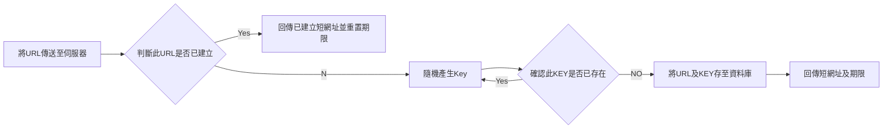
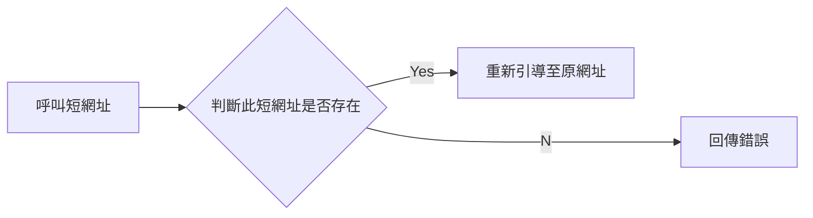

# 專案介紹
這是 2022 年 3-4 月申請 Dcard 後端實習生的作業，內容為短網址服務建立。

# 使用工具

項目       |工具
----------|----------------
開發語言   | GoLang (申請作業的要求)、go Gin web架構
開發工具   | VScode、Postman、git
資料庫     | XAMPP (Local過程中測試用)、Auzre SQL Server (正式服務中使用)
雲端伺服器 | Heroku


# 使用方式
下面提供兩條 API 進行使用。注意：**Heroku 雲端伺服器會自動休眠，首次使用可能須等待 30 秒喚醒**！

## 生成短網址
Request:
```
curl -X POST https://decard-backend-shorturl-demo.herokuapp.com/create -H 'Content-Type: application/json' -d '{"originalUrl": "{ORIGINAL_URL}"}'
```

系統自動偵測此網址是否已存在資料庫中，若已存在則回傳已建立的短網址並重設期限，若不存在則重新建立。每條短網址具備 6 字元的 KEY，有效期限為 3 年。

Response:
```
{
    "message": "short url created successfully",
    "expire_date": "2025-04-04",
    "shortURL": "decard-backend-shorturl-demo.herokuapp.com/load/LnfgDs"
}
```
如果沒輸入網址
```
{"error": "originalUrl can't be empty"}
```
如果輸入的不是網址
```
{"error": "This originalUrl is invalid."}
```

## 呼叫短網址
Request:
```
curl -X GET https://decard-backend-shorturl-demo.herokuapp.com/load/{KEY}

//這邊提供已建立的短網址供測試
https://decard-backend-shorturl-demo.herokuapp.com/load/NfHK5a
https://decard-backend-shorturl-demo.herokuapp.com/load/h2fhfU
```

呼叫成功
```
Redirect to Original Url
```

如果是呼叫錯誤的短網址
```
{"error": "undefined shortURL"}
```


# 開發思維及步驟

## 第一步：瞭解短網址運作

### 1-1：運作模式

沒做過短網址系統，但又不想一開始就上網找答案，我憑藉後端 API 相關經驗，首先猜測短網址的運作應是透過資料庫紀錄原網址跟短網址 KEY 的映照，並在呼叫時存取兩者的關係。

先思考過後再上網查詢，不僅驗證自己的想法 (超有成就感)，還能在過程中建立更深刻印象。

### 1-2： 測試市面上的短網址服務

既然今天做的功能已經有許多人做過，當然要先了解競品的使用。

這個步驟主要想了解當錯誤使用時，市面系統會如何反應，並整理出下列常見錯誤及回傳訊息：

錯誤操作                   |回傳訊息
--------------------------|----------------------
產生短網址，同網址重複申請  | (回傳已建立的短網址)
產生短網址，輸入的不是網址 |  Please confirm if it is a valid url
呼叫短網址，網址錯誤       | The url is not found
呼叫短網址，已過期        | (測不到，但猜測應該會刪除，所以回傳如上) 


## 第二步：需求與目標

### 2-1：思考我的系統目標

- Key 不能太好猜。考量可能使用此系統縮短具有隱私的網址 (例如雲端資料分享網址等)，如果容易猜到短網址不是件好事...因此不能輕易看出短網址與原網址的關聯性、並且隨機 Key 已使用率不能太高否則容易猜中。
- 加快短網址讀取速度。通常短網址系統讀取頻率遠大於建立頻率，未來要想辦法加快讀取短網址速度，至於建立短網址速度較不要求。
- 避免 KEY 重複使用。因為本系統使用隨機法產生 Key，要有辦法避免 Key 重複。

### 2-2：思考我的系統需要甚麼 API、每項 API 需要的內容

需求1: 建立短網址的 Post API 


需求2: 呼叫短網址的 Get API


### 2-3：額外需求
目前想到一些未來可以加入的額外功能
- 短網址即將過期，需在過期前一個月呼叫時以某種方式提醒。
- 生成短網址時是否需要登入(否需要使用 dev_api_key )，也許讓會員享有更長的短網址期限。
- 將常呼叫的 ShortURL 資訊儲存至 Cache，加快讀取。
- 同時大量短網址呼叫是否能維持可用性，未來可加入 Redis。

### 2-4：資安層面
- 這類呼叫建立資料的 API，常見 SQL 注入攻擊。因此建立短網址的 API 需偵測內容是否為可用的網址型態。


## 第三步：思考讀取頻率&資料庫數據量
開始建立系統前，對於系統的使用預測是很重要的，以這次作業題來說，大概要先思考以下幾點：
- 系統的使用頻率
- 資料存活時間

預先思考使用情況的能幫助預估資料的數量，並依此設計 Short Url 的 Key 長度 (這點很重要！方便自己設計出合適的 Key 長度)，甚至進階思考頻寬等問題。


>假想此系統每月 100 萬筆新資料建立，並且每筆短網址期限 3 年，超過時間即過期並刪除。
>
>那麼在`資料庫的數據大約會有 3600 萬`筆。(這個數據會在後面建立 Key 的步驟用到)
>
>另外計算同時間可能呼叫 Short Url 的請求數量，假設此系統建立與呼叫比例為1:100，以每月100萬筆建立來計算，`每秒鐘 ~40 筆呼叫`。

(不過在此作業中我先以做出功能為主，未來有機會再想辦法處理每秒大量呼叫的優化)

## 第四步：資料庫設計
|項目                      |說明
|-------------------------|--------
| original_url (string)   |儲存原網址
| shortUrl_key (string)   |儲存短網址 Key
| create_date (datetime)  |建立日期
| expire_date (datetime)  |過期日期
| call_time (int)         |短網址呼叫次數 (未來呼叫頻率高的將建立快取)


## 第五步：規劃短網址 KEY 生成邏輯

每次生成的短網址都會有一組對應的 Key，可以視為每一筆資料的 ID，同時呼叫短網址時也是使用這個 Key 來呼叫對應內容，因此如何規劃 Key 是短網址系統中最重要的部分。

原本我打算使用 [Golang UUID套件](https://pkg.go.dev/github.com/google/uuid#pkg-constants)，他會產生 128 bits 的 UUID 並以 32 個字元組成一個字串呈現，例如 "6ba7b810-9dad-11d1-80b4-00c04fd430c8"。雖然可以有效確保不會有 Key 衝突問題，然而要在大量資料庫中尋找對應的 Key 的過程，如此多字元的資料勢必會大幅降低效率。

最後選擇使用最常見的方式，隨機產生 Base62 亂數做為資料的 Key。Base62(a-zA-Z0-9) 以這些字符可以產生 `62^n 種組合`，其中 n 為字符個數。

至於要設定多少字元呢? 

前面提到資料庫可能會有 3600 萬筆資料，稍微計算發現至少要使用 5 個字元(可以產生 62^5 ~= 9 億個組合，若只用 4 個字元則只有 1500 萬不夠使用)。

然而前面目標提過希望這個短網址不會容易被猜中，3600萬/9億~=0.04，代表平均猜 25 次就會猜中 1 個，猜中機率並不低，因此我決定多一碼`使用 6 個 Base62 的編碼字符來建立 Key`。

至於產生方式就先以最基礎的隨機產生法，並在產生後先與資料庫比對，若已存在則重新亂數產生。

## 第六步：開發 API

### 6-1：API 撰寫框架
我選擇使用 golang 開發中常用的 `Gin Web 框架`，一方面是因為許多網路文章推薦，另一方面是他的效能真的很優秀 (如下圖)。

並且 Gin 的 Router 架構跟我習慣的 Node.js express Router 使用方式很像，沒有不用他的理由阿!


### 6-2：與資料庫連線
這部分則參考[這篇文章](https://ithelp.ithome.com.tw/articles/10207409)，搭配基礎的 SQL 語法如 INSERT、UPDATE、SELECT 對資料庫進行存取。

### 6-3：API 內容
基本上 API 的開發都是照著前面第二步 (API內容) 及第五步 (KEY 產生邏輯) 進行撰寫，這邊就不再贅述，細節可以至 [main.go](https://github.com/qmsiteandy/dcard-backend-shortUrl-demo/blob/master/main.go) 程式中看。

在系統程式中沒用到特別的套件，大概下面這些：
- Gin 框架套件 (github.com/gin-gonic/gin)
- dotenv 環境變數套件 (github.com/joho/godotenv)
- SQL 相關套件 (github.com/denisenkom/go-mssqldb)(github.com/go-sql-driver/mysql)

產生隨機 Key 的部分則是自己寫了個簡單的函式，隨機以 Base62 的字元自動產生長度 n 的字串。
```
//以隨機方式產生Base62的Key
func CreateBase62Key(keyLen int) string {

	//Base62字符
	base62 := "abcdefghijklmnopqrstuvwxyz" + "ABCDEFGHIJKLMNOPQRSTUVWXYZ" + "0123456789"

	//儲存Key的容器
	var keyBuilder strings.Builder
	// keyBuilder.Grow(keyLen)

	//迴圈方式產生keyLen個字元的Key
	for i := 0; i < keyLen; i++ {
		//隨機選擇一個字元並加入
		base62_index := rand.Intn(len(base62))
		keyBuilder.WriteByte(base62[base62_index])
	}

	return keyBuilder.String()
}
```

另外我做了一個機制，用來確認使用者輸入的是可用的網址。使用到 net/url 套件，它會對網址進行呼叫測試，若為不可用網址則回傳錯誤。
```
_, err = url.ParseRequestURI(query.OriginalUrl)
	if err != nil {
		c.JSON(http.StatusBadRequest, gin.H{"error": "This originalUrl is invalid."})
		return
	}
```

### 6-4：開發過程的困擾
比較讓我困擾的是學習完全沒用過的新語言，對於一些語法的熟悉度還是不夠，邊寫邊踩了很多坑，像是使用go get指令卻無法下載我要的library、SQL回傳的資料得宣告一個type變數儲存、或是vscode會自動刪除沒使用的import使得我後來忘記套件名稱等。

學習新語言的過程算是悲歡參半，雖然有些在其他語言好用的寫法無法使用這點還挺困擾，但也能接觸到不同語言的特色，也算是種增廣見聞，而且很有成就感！


## 第七步：部屬資料庫Server、API Server
### 7-1：
為了能實際應用，我將自己開發的系統部屬到雲服務中。主要分為兩部分：
- 主程式 Web API 部屬至 Heroku，好處是他的部屬方式很簡單，只需要以簡單的git指令就能push上去。
- 資料庫使用 Azure SQL Server & Database，選擇此平台主要原因是我對他比較熟悉，而且 Azure 有提供針對 GO 的範例，可以節省我重新研究的時間。


### 7-2：部屬過程的踩坑分享

#### 第一項、SQL 語法中的變數

前面 6-2 提過我參考[這篇文章](https://ithelp.ithome.com.tw/articles/10207409) 在 GO 中 使用 SQL。教學中使用的這行程式，在 XAMPP 的 Local 資料庫是可以正常運行的
```
db.QueryRow("SELECT * FROM DemoTable WHERE shortUrl_key = ?", newKey)
```
然而使用 Azure 資料庫時，卻回傳無法使用 "?" ，找了很久才了解需要改用下面的寫法，才能被運行。
```
db.QueryRow("SELECT * FROM DemoTable WHERE shortUrl_key = @key", sql.Named("key", newKey))
```

#### 第二項、Heroku 環境變數衝突
Azure SQL Server 開放的呼叫 PORT 為 1433，我也的確在 .env 中設定 PORT 了，然而在 Heroku 運行時，卻一直顯示 "不可使用 PORT = 38560" ??? 最後才想到可能是 Heroku 中也有使用到一樣的 PORT 環境變數名稱，於是將全部環境變數改名後，就能順利運行了！

#### 第三項、AZURE SQL Server 防火牆
這點真的是自己犯蠢.. 忘記要開啟防火牆，然而 Heroku 伺服器每次呼叫 IP 都不相同令我有些困擾，目前設定為 0.0.0.0 - 255.255.255.255 都能呼叫。


# 目前還未製作項目

#### 第一項、規劃Cache

在我的系統設計中，資料庫每一筆短網址皆會紀錄被呼叫次數，考量到可能有網址被頻繁呼叫，未來可以針對呼叫頻率高的短網址資料加入快取機制，能提升系統運行效率。

#### 第二項、定期清理資料庫

針對已經超出有效期限的短網址，未來可以加入自動清除機制。目前的想法是寫一個程式，在每天深夜系統使用率低的時候進行自動清除。

#### 第三項、測試同時大量使用，並優化效能
為來還可進行壓力測試，了解此系統的極限，並對 SQL 進行優化。倘若今天是正式上線的服務，也可以考慮部屬到自己建立的主機或是提升雲端服務的預算。


# 心得
透過完成一項小專案是學習程式的最好方式，一週多的密集 coding 讓我對 go 這個未曾聽過的語言逐漸熟悉。

以前使用過 Python Flash、 Node.js Express 寫過一些 Web API Server，所以開發邏輯不算太困難，比較多時間都在與新語言"培養感情"。雖然仍稱不上熟悉，但在過程中發現這套程式也有許多優點，例如它會自動清掉不必要的函式引入、運行速度快等等，相信還有更多特色等著我去學習，因此未來也會繼續研究這套語言，並把它放入開發工具考量中！

感謝 Dcard 提供這次申請實習的機會，讓我多瞭解學習了一項技術，對我而言也是開啟一項新成就。不論未來是否成功申請，這都是一項令我成長的作品。

## 補充
繳交作業前一刻突然發現，作業說明文件中要求使用 Go 語言，但實習申請網站提到也可以使用 Node.js 哈哈

沒關係，趁機學了一項新語言！


