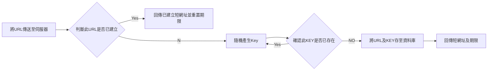
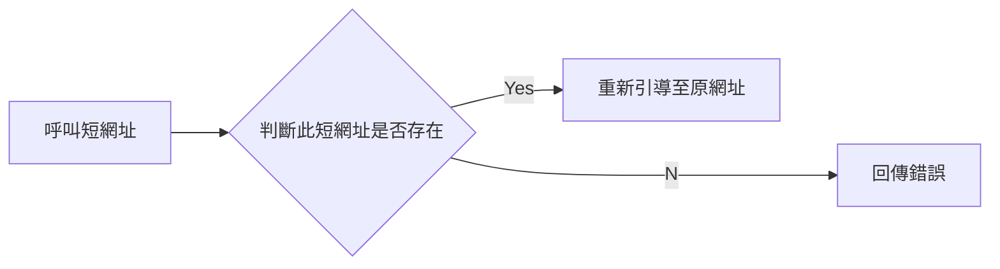

# 專案介紹
這是2022年3-4月申請Dcard後端實習生的作業，內容為短網址服務建立。

# 使用工具

項目       |工具
----------|----------------
開發語言   | GoLang (申請作業的要求)、go Gin web架構
開發工具   | VScode、Postman、git
資料庫     | XAMPP (Local過程中測試用)、Auzre SQL Server (正式服務中使用)
雲端伺服器 | Heroku


# 使用方式
下面提供兩條API進行使用。注意：**Heroku雲端伺服器會自動休眠，首次使用可能須等待30秒喚醒**！

## 生成短網址
Request:
```
curl -X POST https://decard-backend-shorturl-demo.herokuapp.com/create -H 'Content-Type: application/json' -d '{"originalUrl": "{ORIGINAL_URL}"}'
```

系統自動偵測此網址是否已存在資料庫中，若已存在則回傳已建立的短網址並重設期限，若不存在則重新建立。每條短網址具備6字元的KEY，有效期限為3年。

Response:
```
{
    "message": "short url created successfully",
    "expire_date": "2025-04-04",
    "shortURL": "decard-backend-shorturl-demo.herokuapp.com/load/LnfgDs"
}
```
<font color="red"> 如果不是網址? </font>

## 呼叫短網址
Request:
```
curl -X GET https://decard-backend-shorturl-demo.herokuapp.com/load/{KEY}
```

呼叫成功
```
Redirect to Original Url
```

如果是呼叫錯誤的短網址
```
{"error": "undefined shortURL"}
```


# 開發思維及步驟

## 第一步：瞭解短網址運作

### 1-1：運作模式

沒做過短網址系統，但又不想一開始就上網找答案，我憑藉後端API相關經驗，首先猜測短網址的運作應是透過資料庫紀錄原網址跟短網址KEY的映照，並在呼叫時存取兩者的關係。

先思考過後再上網查詢，不僅驗證自己的想法(超有成就感)，更能在過程中建立更深刻印象。

### 1-2： 測試市面上的短網址服務

既然今天做的功能已經有許多人做過，當然要先了解競品的使用。

這個步驟主要想了解當錯誤使用時，市面系統會如何反應，並整理出下列常見錯誤及回傳訊息：

錯誤操作                   |回傳訊息
--------------------------|----------------------
產生短網址，同網址重複申請  | (回傳已建立的短網址)
產生短網址，輸入的不是網址 |  Please confirm if it is a valid url
呼叫短網址，網址錯誤       | The url is not found
呼叫短網址，已過期        | (測不到，但猜測應該會刪除，所以回傳如上) 


## 第二步：需求與目標

### 2-1：思考我的系統目標

- Key不能太好猜。考量可能使用此系統縮短具有隱私的網址(例如雲端資料分享網址等)，如果容易猜到短網址不是件好事...因此不能輕易看出短網址與原網址的關聯性、並且隨機Key使用率不能太高否則容易猜中。
- 加快短網址讀取速度。通常短網址系統讀取頻率遠大於建立頻率，未來要想辦法加快讀取短網址速度，至於建立短網址速度較不要求。
- 避免KEY重複使用。因為本系統使用隨機法產生Key，要有辦法避免Key重複。

### 2-2：思考我的系統需要甚麼API、每項API需要的內容

需求1: 建立短網址的Post API 


需求2: 呼叫短網址的Get API


### 2-3：額外需求
目前有想到一些可以加入的功能，但不確定時間是否來得及
- 短網址即將過期，需在過期前一個月呼叫時以某種方式提醒。
- 生成短網址時是否需要登入(否需要使用dev_api_key)，也許讓會員享有更長的短網址期限。
- 將常呼叫的ShortURL資訊儲存至Cache，加快讀取。
- 同時大量短網址呼叫是否能維持可用性，未來可加入Redis。

### 2-4：資安層面
- 這類呼叫建立資料的API，常見SQL注入攻擊。因此建立短網址的API需偵測內容是否為正常網址型態。


## 第三步：思考讀取頻率&資料庫數據量
開始建立系統前，對於系統的使用預測是很重要的，以這次作業題來說，大概要先思考以下幾點：
- 系統的使用頻率
- 資料存活時間

預先思考使用情況的能幫助預估資料的數量，並依此設計 Short Url 的 Key 長度(這點很重要！方便自己設計出合適的 Key 長度)，甚至進階思考頻寬等問題。


>假想此系統每月100萬筆新資料建立，並且每筆短網址期限3年，超過時間即過期並刪除。
>
>那麼在`資料庫的數據大約會有3600萬`筆。(這個數據會在後面建立Key的步驟用到)
>
>另外計算同時間可能呼叫 Short Url 的請求數量，假設此系統建立與呼叫比例為1:100，以每月100萬筆建立來計算，`每秒鐘~40筆呼叫`。

(不過在此作業中我先以做出功能為主，未來有機會再想辦法處理每秒大量呼叫的優化)

## 第四步：資料庫設計
|項目                      |說明
|-------------------------|--------
| original_url (string)   |儲存原網址
| shortUrl_key (string)   |儲存短網址Key
| create_date (datetime)  |建立日期
| expire_date (datetime)  |過期日期
| call_time (int)         |短網址呼叫次數 (未來呼叫頻率高的將建立快取)


## 第五步：規劃短網址KEY生成邏輯

原本打算使用[Golang UUID套件](https://pkg.go.dev/github.com/google/uuid#pkg-constants)，他會產生128 bits的UUID並以32個字元組成一個字串呈現，例如"6ba7b810-9dad-11d1-80b4-00c04fd430c8"，雖然可以有效確保不會有Key衝突問題，然而要在大量資料庫中尋找對應的Key的過程，如此多字元的資料勢必會大幅降低效率。

最後選擇使用隨機產生Base62亂數做為資料的Key。Base62(a-zA-Z0-9) 以這些字符可以產生62^n中組合，其中n為字符個數。

前面提到資料庫可能會有3600萬筆資料，稍微計算發現至少要使用5個字元(可以產生62^5 ~= 9億個組合，若只用4個字元則只有1500萬不夠使用)。

然而前面目標提過希望這個短網址不會容易被猜中，3600萬/9億~=0.04，代表猜25次就會猜中1個，猜中機率並不低，因此我決定多一碼使用6個Base62的編碼字符來建立Key。

至於產生方式就先以最基礎的隨機產生法，並在產生後先與資料庫比對，若已存在則重新亂數產生。

第五步：規劃API

我選擇使用golang開發中常用的Gin Web框架，一方面是因為許多網路文章推薦，另一方面是他的效能真的很優秀(如下圖)。

圖片來源：https://hackernoon.com/the-myth-about-golang-frameworks-and-external-libraries-93cb4b7da50f

圖片來源：http://qwding.github.io/post/golang_framwork_pk/

並且他跟我習慣的Node.js express Router使用方式很像，沒有不用他的理由阿!

與資料庫連線部分參考https://ithelp.ithome.com.tw/articles/10207409


生成短網址


第六步：部屬資料庫Server、API Server

資料庫使用Azure雲端服務中的SQL server、SQL database、並搭配Microsoft SQL Server Manager Studio(SSMS)進行操作

要注意的是SQL語法中無法使用? 得改用

.env中 PORT變數似乎被Heroku衝突，原本設定為1433然而在heroku呼叫函式時卻變成38560，找了很久才發現，於是把.env中的PORT名稱全部大改

AZURE 防火牆

第七步：規劃Cache

第八步：定期清理資料庫


反省
應該早點用Heroku Config

不習慣
以往使用node.js consolog 在Heroku上都能看見log訊息很好除錯，但是go 的 fmt 卻無法順利印出

額外發想
有沒有可能將新資料的索引值編碼成62進制作為短網址的Key? 
但缺點是1. 如果有Expired或delete的檔案，那個資料位置要空著，不能將後面的資料索引值shift 不然會失效。2. 可能會比較容易被猜中，畢竟Key的規律相對容易發現。

目前建立資料的方式會搜尋URL跟KEY是否存在，很耗時間
